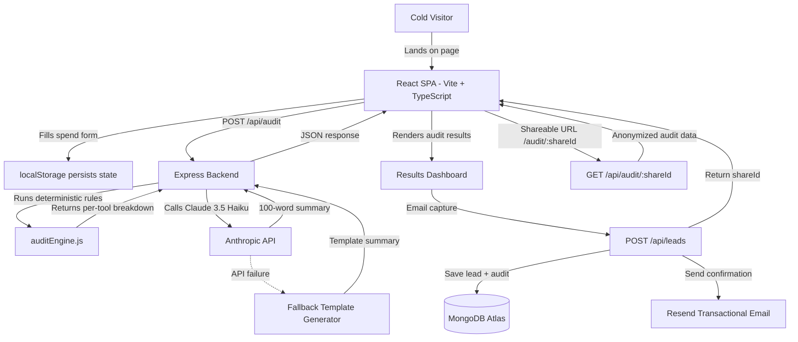

# Architecture & Technical Decisions

## System Diagram

## Data Flow: Input → Audit Result

1. **User fills form:** Tools, plans, seats, monthly spend, team size, use case. State persists in `localStorage`.
2. **Frontend validates** and sends `POST /api/audit` with the tool array.
3. **`auditEngine.js` runs 6 checks per tool:**
   - Overpaying vs. verified list price
   - Plan downgrade opportunity (e.g., Max → Pro)
   - Unused seats (seats > teamSize)
   - Solo user on team/enterprise plan
   - Cheaper alternative tool for same use case
   - Credex discount credit eligibility
4. **Engine aggregates** total monthly/annual savings and sets `showCredexCTA` flag if savings > $500/mo.
5. **AI summary** is generated via Anthropic API (or fallback template).
6. **Frontend renders** hero savings card, per-tool breakdown cards, and lead capture form.

## Why This Stack

| Layer | Choice | Why |
|-------|--------|-----|
| Frontend | React 19 + Vite + TypeScript | Fast HMR, type safety, massive ecosystem. No SSR needed for a form-based SPA. |
| Styling | Tailwind CSS v3 + shadcn/ui | Utility-first for rapid iteration. shadcn gives accessible, unstyled primitives. |
| Backend | Node.js + Express | Simple, battle-tested. Full control over routes, middleware, and error handling. |
| Database | MongoDB Atlas (Mongoose) | Flexible schema for storing arbitrary audit JSON. Free tier for MVP. |
| AI | Anthropic Claude 3.5 Haiku | Fast, cheap, high-quality summaries. Preferred per assignment spec. |
| Email | Resend | Modern transactional email API. Free tier covers MVP volume. |
| CI | GitHub Actions | Native to GitHub. Runs tests + build on every push. |

## Scaling to 10k Audits/Day

1. **Add Redis caching** for pricing data lookups (currently in-memory, fine for MVP).
2. **Queue AI summary generation** via Bull/BullMQ — the Anthropic call is the bottleneck (~2s). Return the audit instantly, backfill the AI summary async.
3. **Rate limit per IP** using `express-rate-limit` middleware (currently honeypot only).
4. **Move to serverless** — the audit engine is stateless and CPU-light. Deploy as Vercel Edge Functions or Cloudflare Workers.
5. **Horizontal scaling** — MongoDB Atlas auto-scales reads. Express is stateless, so spin up N containers behind a load balancer.
